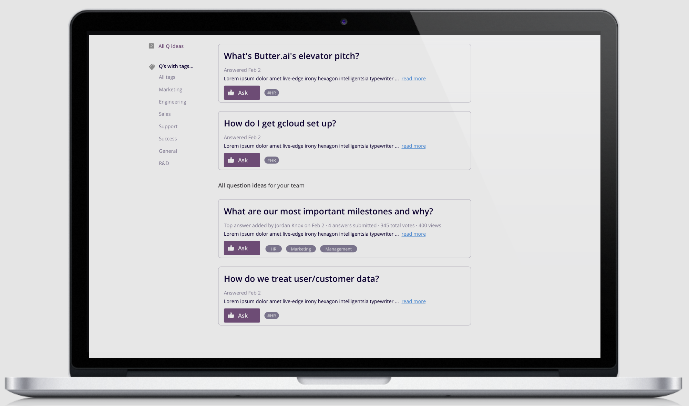

# Omni

Omni is a knowledge management platform that makes you smarter by putting your company’s knowledge at your fingertips.

* [Client](https://github.com/thinkful-ei-macaw/omniqa-front-end)
* [Server](https://github.com/thinkful-ei-macaw/omniqa-backend) 
* [Live](https://omniqa.now.sh/)

## Demo credentials 

* username: MJ
* password: ASDFasdf12!@

## Screenshots

## Features

* Feed
* Ask Questions per department
* Answer Questions per department
* Like Questions
* View Multiple Answers  
* Smart filters
* Private lists

## Team 

* Dasha Akhten
* Glen Larrabee
* Jordan Knox
* Patrick Nguyen 
* Connor McCormack

## Tech Stack

* React - A JavaScript library for building user interfaces
* Node - An open source server environment
* HTML - Hypertext Markup Language
* PostgreSQL - A open source database
* CSS - Cascading Style Sheets
* JavaScript - A lightweight, interpreted, or just-in-time compiled programming language
* Enzyme - A JavaScript Testing utility for testing React Components
* Mocha - A feature-rich JavaScript test framework
* Moment - A React component for the moment date library.
* jwt-decode - A small browser library that helps decoding JWT tokens which are Base64Url encoded

## Credits

* [Black Illustrations ](https://www.blackillustrations.com/)
* [Undraw Illustrations](https://undraw.co/)